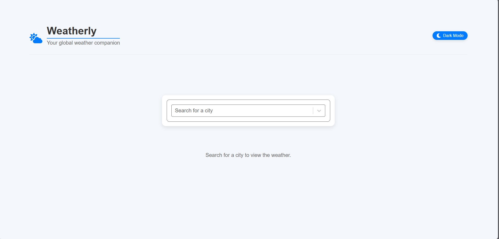
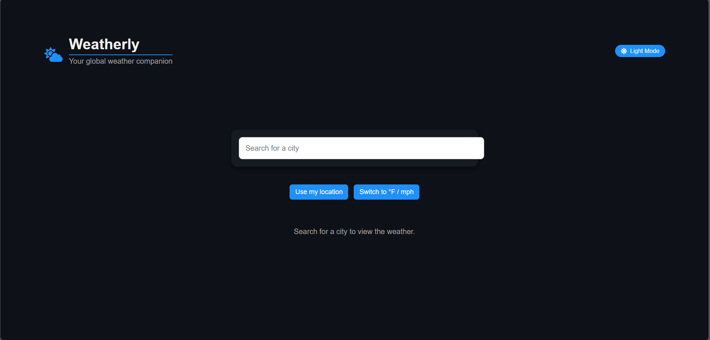

# 🌦 Weatherly – A Modern Weather App

**Weatherly**  is a modern, responsive weather app that delivers real-time weather data and 5-day forecasts for cities worldwide. Built with **React** and **Express**, it integrates with the **OpenWeather API** and **GeoDB Cities API** for accurate and dynamic data.

## 🚀 Features

- ✅ **Current Weather Conditions** – Temperature, humidity, wind speed, pressure, and descriptions.
- ✅ **5-Day Forecast** – See daily summaries with expandable details.
- ✅ **Smart City Search** – Auto-complete with real-time city suggestions.
- ✅ **Light & Dark Mode** – Theme toggle with persistent user preference.
- ✅ **User Feedback** – Toast notifications and graceful error handling.
- ✅ **Responsive Design** – Optimized for desktop and mobile devices.

## 🧰 Tech Stack

### 🔹 Frontend
- ⚛️ React 18 with Hooks
- 🔧 Axios
- 🎨 CSS Modules
- 🔔 React Toastify
- 🔍 React Select (AsyncPaginate)
- 🌈 React Icons

### 🔹 Backend
- 🖥 Node.js + Express
- 🌐 Axios
- 🔐 Dotenv
- 🔄 CORS

### 🔹 APIs
- 🌤 [OpenWeather API](https://openweathermap.org/)
- 🏙 [GeoDB Cities API](https://rapidapi.com/wirefreethought/api/geodb-cities)

---

## 📷 Screenshots




---

## 🛠 Installation & Setup

### 1. Clone the repository
```bash
git clone https://github.com/DenislavaVM/weatherly.git
cd weatherly
```

### 2. Install dependencies

#### Frontend:
```bash
npm install
```

#### Backend:
```bash
cd server
npm install
```

### 3. Set up environment variables

#### Copy example files:
```bash
cp .env.example .env
cp server/.env.example server/.env
```

#### Then update with your API keys:

**Frontend (`.env`):**
```env
REACT_APP_RAPIDAPI_KEY=your_rapidapi_key_here
REACT_APP_OPENWEATHER_KEY=your_openweather_api_key_here
```

**Backend (`server/.env`):**
```env
RAPIDAPI_KEY=your_rapidapi_key_here
OPENWEATHER_API_KEY=your_openweather_api_key_here
```
### 4. Start the app

#### Start backend server:
```bash
cd server
npm start
```

#### Start frontend:
```bash
cd ..
npm start
```

📍 Visit: `http://localhost:3000` (Frontend)  
🔗 API runs at: `http://localhost:5000`

---

## 🌍 Live Demo

[🔗 Try the Live Version](https://weatherly-tau-three.vercel.app/)

---

## 📘 How It Works

1. Search for a city using the search bar.
2. Select a result from the dropdown suggestions.
3. View current weather data and a 5-day forecast.
4. Toggle light/dark mode anytime.
5. Get real-time toast notifications and error messages.

---

## 🔌 API Endpoints (Backend)

- `GET /api/weather?lat={latitude}&lon={longitude}` – Get current weather
- `GET /api/forecast?lat={latitude}&lon={longitude}` – Get 5-day forecast
- `GET /api/cities?query={city_name}` – Get city suggestions

---

## 🔮 Future Enhancements

- 🌍 Location-based weather (auto-detect via geolocation)
- 📊 Graphs & visual forecast charts
- 🧪 Unit tests and e2e testing
- 📱 PWA support & offline caching
- 🎤 Voice search integration

---

## 📄 License

📄 Licensed under the [MIT License](./LICENSE).